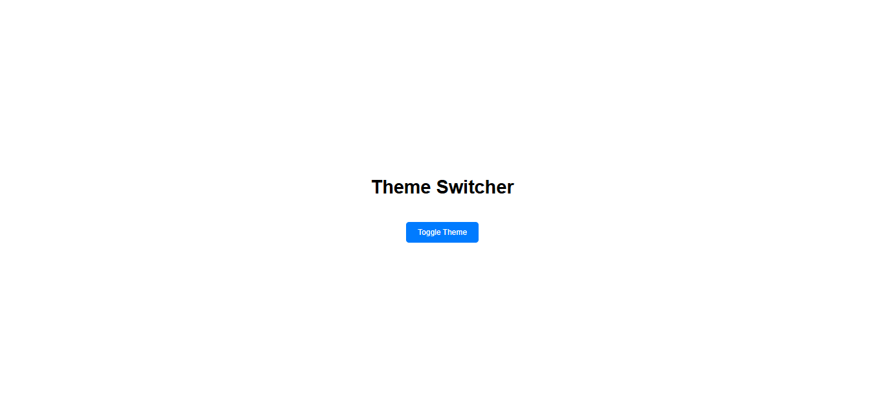
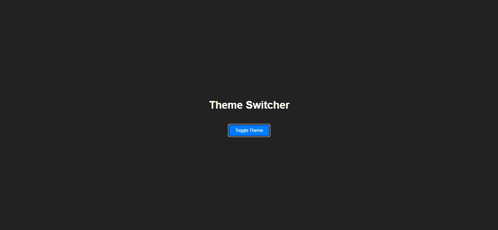

# 🌗 Light & Dark Theme Toggle

A minimal UI project built using HTML, CSS, and JavaScript that allows users to switch between light and dark themes with a single button click.

---

## ✨ Features

- 🌞 Light mode UI
- 🌙 Dark mode UI
- 🔘 One-click theme toggle button
- 🎨 Smooth and clean UI transitions
- ⚡ Lightweight and fast
- 📱 Responsive design

---

## 🛠️ Tech Stack

- HTML5
- CSS3
- JavaScript

---

## 📸 Preview





---

## 🚀 Getting Started

1. Clone the repository

```bash
git clone https://github.com/your-username/theme-toggle.git
Open project folder
cd theme-toggle
Run the project
```

Open index.html in your browser.

## 📂 Project Structure

```bash
theme-toggle/
│── index.html
│── style.css
│── script.js
└── screenshot.png
```

## 👨‍💻 Author
Made with ❤️ by Your Abdur Rahman
